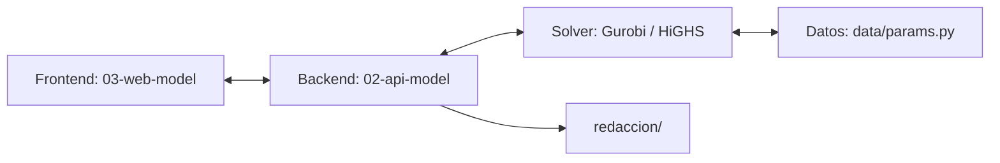

# 🍋 Optimizador Cadena de Suministro Cítricos v3.0

Dashboard profesional para la toma de decisiones estratégicas en la cadena de suministro de cítricos. Este sistema utiliza optimización matemática multiobjetivo para equilibrar la rentabilidad económica con el impacto ambiental y social.

> [!IMPORTANT]
> **Ejes de Optimización:** Minimización de Costos, Minimización de Emisiones de CO2 y Maximización de Empleo.

---

## 🏗️ Arquitectura del Proyecto

El sistema se divide en dos componentes principales:



*   **`02-api-model`**: Backend desarrollado en FastAPI que gestiona la lógica de los modelos matemáticos (LGP y Epsilon-Restricción) usando Pyomo.
*   **`03-web-model`**: Interfaz de usuario moderna y reactiva construida con Vanilla JS, TailwindCSS y Chart.js.

---

## 📥 Cómo obtener el proyecto

### Opción A: Si no sabes usar Git (Recomendada)
1.  En la página de GitHub donde estás viendo esto, haz clic en el botón verde **Code**.
2.  Selecciona la opción **Download ZIP**.
3.  Descomprime el archivo en tu escritorio.

### Opción B: Si eres usuario avanzado
```powershell
git clone https://github.com/kevinrodriguezquintero/OPM_CSC_V3.git
```

---

## 🚀 Guía de Instalación Rápida (Solo la primera vez)
Para que el Optimizador funcione, necesitas preparar tu computadora siguiendo estos **3 pasos**:

1.  **Instala los Requerimientos:** Abre una terminal en la carpeta del proyecto y corre:
    ```powershell
    python -m venv 02-api-model/venv
    ./02-api-model/venv/Scripts/Activate.ps1
    pip install -r 02-api-model/requirements.txt
    ```
2.  **¡IMPORTANTE!** El sistema usa un "Solver" (motor matemático). Asegúrate de que `highspy` esté en la lista anterior.
3.  **Lanzar el Dashboard:**
    *   **Windows:** Ejecuta `start.ps1` (clic derecho → "Ejecutar con PowerShell")
    *   **Linux/Mac:** Ejecuta `./start.sh`

    ¡Listo! Se abrirán dos ventanas y podrás usar el Dashboard:
    *   **Dashboard UI:** [http://localhost:3000](http://localhost:3000)
    *   **Documentación API (Swagger):** [http://localhost:8000/docs](http://localhost:8000/docs)

---

## 📖 Módulos del Dashboard

El sistema permite realizar análisis profundos a través de diferentes enfoques:

1.  **⚖️ LGP (Goal Programming):** Optimización jerárquica basada en prioridades fijas (Costo > Emisiones > Empleo).
2.  **📈 ER (Epsilon-Restricción):** Exploración de la **Frontera de Pareto** para encontrar el compromiso ideal entre objetivos en conflicto.
3.  **🔬 OAT (One-At-A-Time):** Análisis de sensibilidad para ver cómo reacciona el modelo ante variaciones del ±10%, ±20%, etc., en cualquier parámetro.
4.  **📊 Escenarios:** Comparativa directa lado a lado entre los resultados de LGP y ER.
5.  **🛡️ Rangos (Robustez):** Cálculo de **Precios Sombra** unitarios y rangos físicos admisibles de variación para cada eslabón de la cadena.
6.  **📝 Redacción Académica:** Exportación automática de resultados a plantillas markdown para tesis (`redaccion/` → `plantillas/`)

---

## 🛠️ Notas Técnicas
*   **Solvers:** Configurado por defecto para **Gurobi** (requiere licencia). Alternativa open source: **HiGHS** (configurable en `02-api-model/config.py`).
*   **Parámetros:** Los datos técnicos de granjas, intermediarios y detallistas se gestionan centralmente en `02-api-model/data/params.py`.
*   **Exportación de Resultados:** Los análisis (LGP, ER, OAT, Rangos, Escenarios) se guardan automáticamente en `redaccion/resultados/` y pueden consolidarse a plantillas markdown vía `redaccion/tools/consolidar_resultados.py`.

---
© 2024-2025 Optimización de Cadenas de Suministro - Proyecto Cítricos
